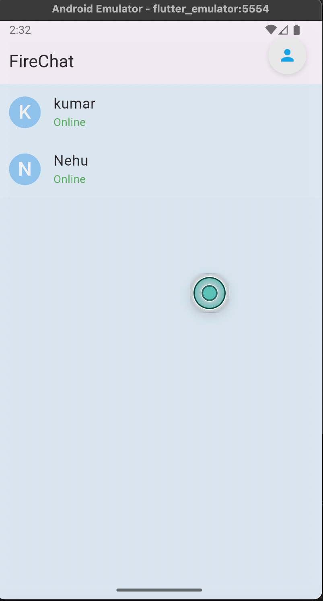
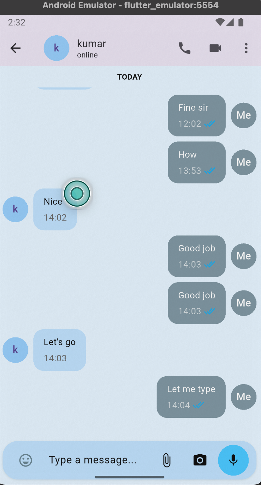
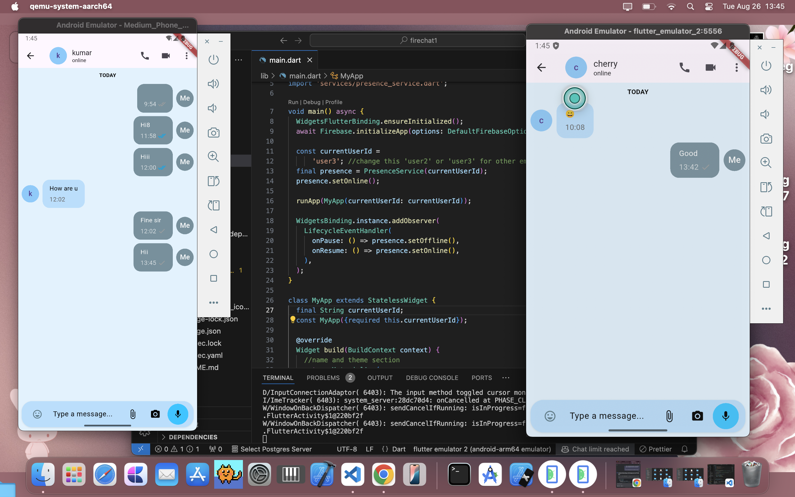

# FireChat 🔥💬  

by Drona Bopche
Assignment by priyaquibtpvtlt  

<div align="center">

  
  
  

</div>

---

## ✨ Features  

### 💬 Real-time Messaging  
- Instant message delivery using Firebase Firestore  
- Organized chat threads between users  
- Timestamped messages for conversation tracking  

### 👥 User Presence System  
- **Online/Offline Status**: Visual indicators show when users are active  
- **Last Seen Tracking**: Displays when users were last active  
- **Automatic Status Updates**: Status changes based on app lifecycle events  

### ✅ Message Status Indicators  
- **Single Tick** : Message sent to Firebase  
- **Double Grey Ticks** : Message delivered to recipient device  
- **Double Blue Ticks** : Message seen by recipient  

### 🎨 Beautiful WhatsApp-inspired UI  
- Modern gradient backgrounds  
- Intuitive chat bubbles with different colors for sent/received messages  
- Professional navigation and layout  

### 📱 Responsive Design  
- Optimized for both iOS and Android  
- Adaptive layouts for different screen sizes  
- Smooth animations and transitions  

---

## 🛠️ Technology Stack  

- **Frontend**: Flutter with Dart  
- **Backend**: Firebase Firestore  
- **Authentication**: Firebase Authentication (ready for implementation)  
- **State Management**: Built-in Flutter state management  
- **Real-time Updates**: Firebase Streams  

---

## 📸 Screenshots  

### Home Screen  
  

### Chat Screen  
  

### both together Screen  
  

--


## 🚀 Installation  

### Prerequisites  
- Flutter SDK (latest version)  
- Firebase project setup  
- Android Studio/Xcode for emulation  

### Setup Steps  

1. **Clone the repository**  
   ```bash
   git clone https://github.com/yourusername/firechat.git
   cd firechat

